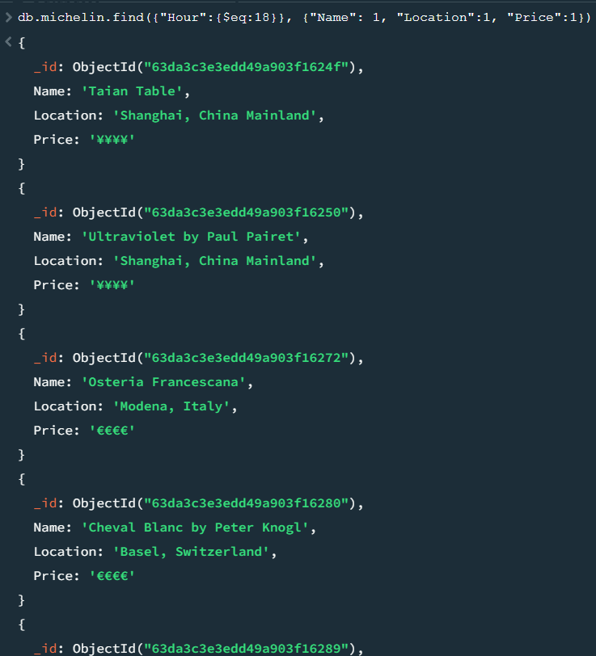
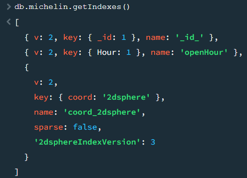
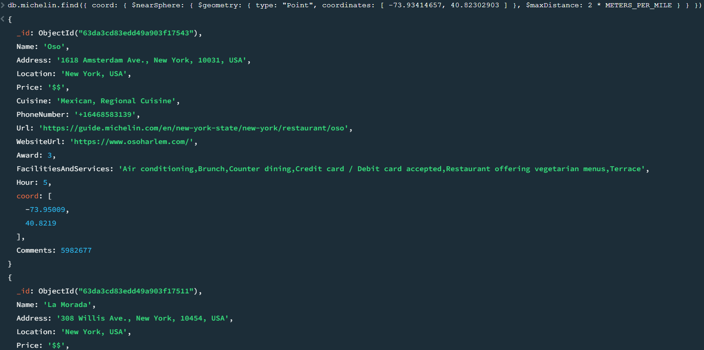
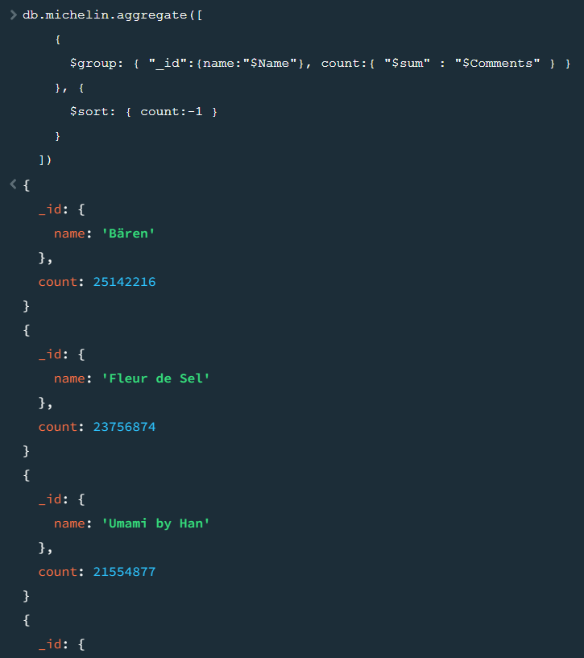
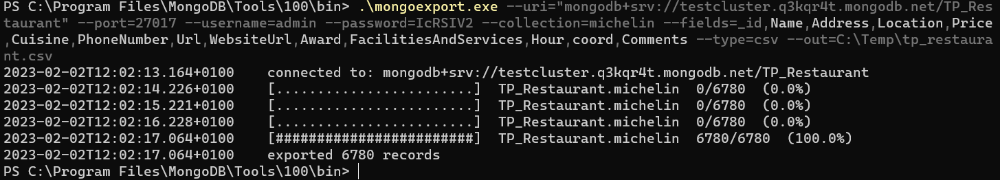
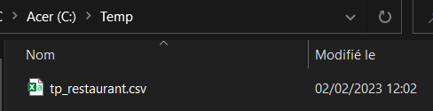

# Préparation des données:
a. Importez un jeu de données de localisation, comme les restaurants dans une ville. Vous pouvez utiliser la commande mongoimport pour importer des données dans MongoDB.

>```
>.\mongoimport.exe --uri="mongodb+srv://testcluster.q3kqr4t.mongodb.net/TP_Restaurant" --port=27017 --username=admin --password=IcRSIV2 --collection=michelin  --fields=Name,Address,Location,Price,Cuisine,Longitude,Latitude,PhoneNumber,Url,WebsiteUrl,Award,FacilitiesAndServices --type=csv --file=C:\Users\chris\Downloads\michelin_my_maps.csv\michelin_my_maps.csv
>```
>

b. Assurez-vous d'avoir un champ de localisation géospatiale, comme la latitude et la longitude.
>

&nbsp;	

---

&nbsp;

# Requêtes MongoDB:
a. Recherchez les restaurants qui sont ouverts à partir de 18h00. Utilisez la méthode find () et les opérateurs de comparaison pour trouver les documents qui correspondent à vos critères.

> Étant donné que ma collection n'avait pas de `key` Heure ni de `value` associé, je l'ai donc crée en utilisant `aggregate` pour récupérer les `value` aléatoirement à l'aide de la requète suivante:
>
> ```
> db.michelin.aggregate(
>   [
>      { $set: { Hour: { $multiply: [ { $rand: {} }, 20 ] } } },
>      { $set: { Hour: { $floor: "$Hour" } } },
>      { $merge: "michelin" }
>   ]
>)
> ```
>
> Requète des restaurants ouvrant à 18h00:
> ```
> db.michelin.find({"Hour":{$eq:18}}, {"Name": 1, "Location":1, "Price":1})
> ```
>

b. Triez les restaurants par note, du plus haut au plus bas. Utilisez la méthode sort () pour trier les résultats.

> ```
> db.michelin.find().sort({"Award": 1})
> ```
>

&nbsp;	

---

&nbsp;

# Indexation avec MongoDB:
a. Créez un index sur le champ d'ouverture des restaurants pour améliorer les performances de la recherche. Utilisez la méthode createIndex ().

>&nbsp;
> ```
> db.michelin.createIndex({"Hour":1}, {name: "openHour"})
> ```
>&nbsp;

b. Vérifiez que l'index a été créé en utilisant la méthode listIndexes ().


> Comme on peut le constater l'inex `openHour` à bien été créé.
> ```
> db.michelin.getIndexes()
> ```
>

&nbsp;	

---

&nbsp;

# Requêtes géospatiales:
a. Recherchez les restaurants qui se trouvent à moins de 2 km d'une certaine localisation. Utilisez la méthode find () avec un opérateur géospatial pour trouver les restaurants à l'intérieur d'un cercle.

>J'ai commencé par créer la variable `METERS_PER_MILE` ayant pour `value: 1609.34` (ce qui équivaut à 1 miles).
>
> ```
>var METERS_PER_MILE = 1609.34
>```
> Ensuite j'effectue la recherche et j'utilise ma variable pour établir la distance de 2km
>```
> db.michelin.find({ coord: { $nearSphere: { $geometry: { type: "Point", coordinates: [ -73.93414657, 40.82302903 ] }, $maxDistance: 2 * METERS_PER_MILE } } })
> ```
>

b. Recherchez les restaurants qui se trouvent dans un certain rayon autour d'un point de localisation spécifique. Utilisez la méthode find () avec un opérateur géospatial pour trouver les restaurants à l'intérieur d'un cercle.

> ```
> db.michelin.find({ coord:{ $geoWithin: { $centerSphere: [ [ -73.93414657, 40.82302903 ], 5 / 3963.2 ] } } })
> ```
>

&nbsp;	

---

&nbsp;

# Framework d'agrégation:
a. Calculez la moyenne des notes des restaurants. Utilisez le framework d'agrégation de MongoDB pour effectuer des calculs sur les données.

>&nbsp;
> ```
> db.michelin.aggregate([
>    {"$group" : {"_id":"$Award", count:{"$sum" : 5}}}
> ])
> ```
>&nbsp;

b. Trouvez les restaurants les plus populaires en fonction du nombre de commentaires. Utilisez le framework d'agrégation de MongoDB pour groupes les données et effectuer des calculs.

> ```
> db.michelin.aggregate([
> {
>   $group: { "_id":{name:"$Name"}, count:{ "$sum" : "$Comments" } }
> },{
>   $sort: { count:-1 }
>   }
> ])
> ```
>

&nbsp;	

---

&nbsp;

# Export de la base de données:
a. Exportez les résultats des requêtes dans un fichier CSV pour un usage ultérieur. Utilisez la commande mongoexport pour exporter des données de MongoDB.

> ```
> .\mongoexport.exe --uri="mongodb+srv://testcluster.q3kqr4t.mongodb.net/TP_Restaurant" --port=27017 --username=admin --password=IcRSIV2 --collection=michelin --fields=_id,Name,Address,Location,Price,Cuisine,PhoneNumber,Url,WebsiteUrl,Award,FacilitiesAndServices,Hour,coord,Comments --type=csv --out=C:\Temp\tp_restaurant.csv
> ```
> Résultat :
>
>